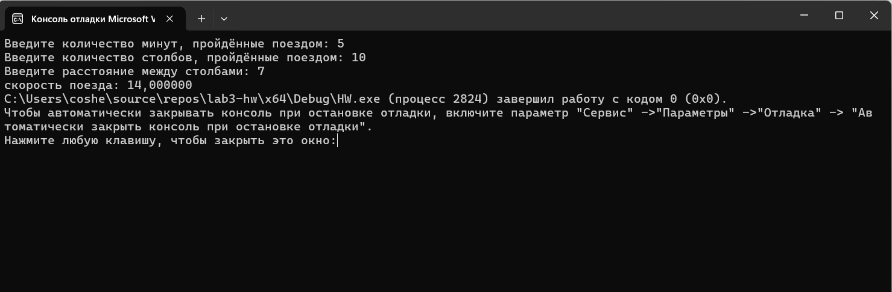

# Домашняя работа к лабораторной работе 3.
## Условия задачи:
Поезд за m минут проходит t столбов. Определить скорость поезда, если между столбами S метров.
## 1. Алгоритм и блок схема:
### Алгоритм:
1. **Начало**
2. Задать исходные данные:
   - `m` = количество минут, пройденные поездом
   - `t` = количество столбов, пройденных опездом
   - `s` = расстояние между столбами
  `result` =  скорость поезда
3. Вычислитьскорость поезда - 
   - `result` = (t * s) / m - скорость 
4. Вывести результаты расчётов с подстановкой значений в текст.
5. **Конец**

### Блок схема

## 2. Реализация программы:

      #include <stdio.h>
      #include <locale.h>

      int main() {

	      setlocale(LC_CTYPE, "");

	      float area, cost;

		  float price = 500;
	  	  float length = 3;
	  	  float width = 0.8;

	      area = width * length;
	      cost = area * price;

	      printf("Стоимость 1 кв метра: %.0f рублей\n", price);
	      printf("Ширина ткани: %.1f м., Длинна ткани: %.0f м.\n", width, length);
	      printf("Площадь ткани: %.1f кв.м.\n", area);
   	   printf("Стоимость всей ткани: %.0f рублей\n", cost);

      }
## 3. Результат работы программы

## 4. Информация о разработчике
Капичников Юрий, бИПТ-252
