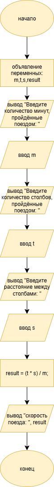

# Домашняя работа к лабораторной работе 3.
## Условия задачи:
Поезд за m минут проходит t столбов. Определить скорость поезда, если между столбами S метров.
## 1. Алгоритм и блок схема:
### Алгоритм:
1. **Начало**
2. Задать исходные данные:
   - `m` = количество минут, пройденные поездом
   - `t` = количество столбов, пройденных опездом
   - `s` = расстояние между столбами
  `result` =  скорость поезда
3. Вычислитьскорость поезда - 
   - `result` = (t * s) / m - скорость 
4. Вывести результаты расчётов с подстановкой значений в текст.
5. **Конец**

### Блок схема

## 2. Реализация программы:
		#include <stdio.h>
		#include <locale.h>

		int main(){
		setlocale(LC_ALL, "");
		float m, t, s, result;
		printf("Введите количество минут, пройдённые поездом: ");
		scanf_s("%f", &m);
		printf("Введите количество столбов, пройдённые поездом: ");
		scanf_s("%f", &t); 
		printf("Введите расстояние между столбами: ");
		scanf_s("%f", &s);
		result = (t * s) / m;
		printf("скорость поезда: %f", result);
		}
## 3. Результат работы программы

## 4. Информация о разработчике
Амелина Юлия, бИПТ-252
